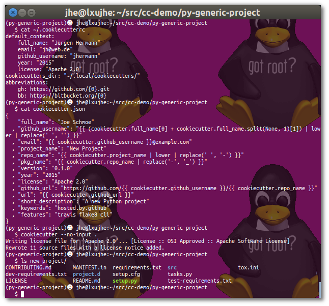
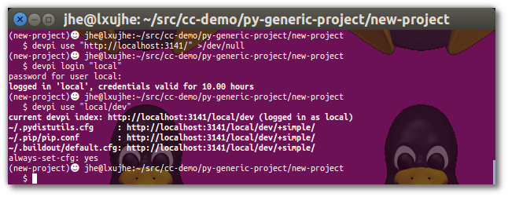
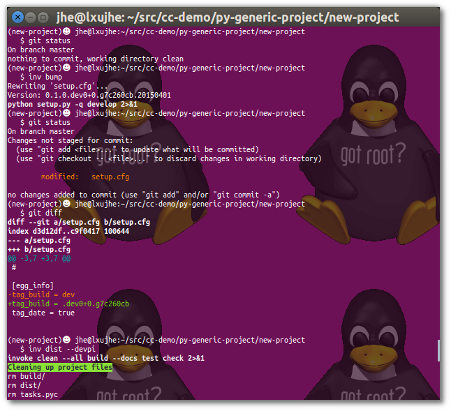
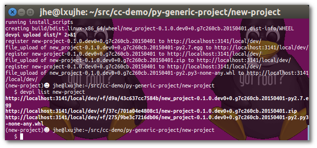
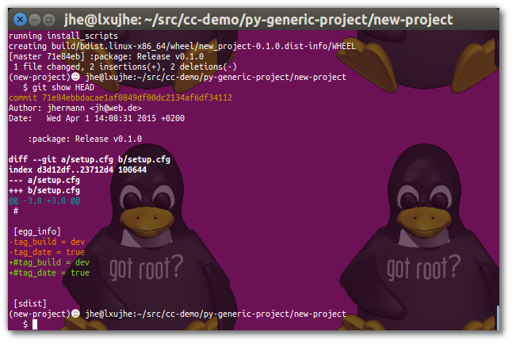
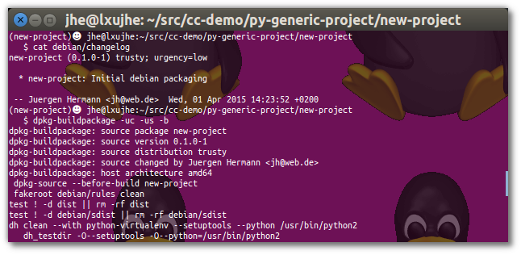
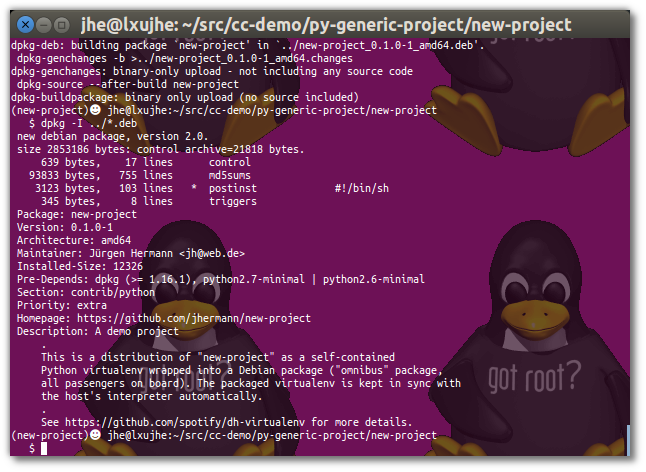

# Creating + Releasing a New Project in 10 Minutes

## Preparation

Install a few tools.

```sh
# create demo sandbox
rm -rf ~/src/cc-demo; mkdir -p ~/src/cc-demo; cd ~/src/cc-demo

git clone -b "enriched-context-for-hooks" "https://github.com/jhermann/cookiecutter.git"
git clone "https://github.com/jhermann/rituals"
git clone "https://github.com/Springerle/py-generic-project"
git clone "https://github.com/Springerle/dh-virtualenv-mold"
```


## Bootstrap

Create a virtualenv with Cookiecutter installed into it.

```sh
cd py-generic-project
. .env --yes --develop
pip -q install -e ../cookiecutter # activate patched version
cookiecutter --version
```


Now use the locally cloned Cookiecutter template “py-generic-project”
to create our demo project.
Normally you'd do that directly from the GitHUb repository (using its URL instead of ‘``.``’).

```sh
rm -rf new-project # make sure there is nothing there
cookiecutter --no-input .
```




Add the created files immediately into a new ``git` repo,
and tag that tree for easy incremental updates of the template.

```sh
cd new-project
git init; git add .
git commit -m "New project from py-generic-project cookiecutter"
git tag -a "v0" -m "Cookiecutter update reference"
```


Create a second virtualenv, this time for the new project.

```sh
. .env --yes --develop
```


## Developing

Run the unit tests (``inv`` is the short form of ``invoke``).

```sh
inv test
```


Run the code quality checks.

```sh
inv check
```


Assuming you have a local ``devpi` install (see “References” below for more),
you can now release a development version for use by your co-workers.

```sh
devpi use "http://localhost:3141/"
devpi login "local"
devpi use "local/dev"
```




Bump the version number to uniquely identify what we're releasing
– the created version number is compliant to PEP-440.

```sh
inv bump
inv dist --devpi
```


…



The template also contains skeletons for normal and test modules.

```sh
# use this to add new modules with a simple "cp"
view project.d/skeleton_module.py
```


## Releasing

Prepare your working directory for a release.

```sh
inv release.prep
```


Oops, we still have those development release version changes lying around! :blush:

And creating ‘official’ releases from a dirty working directory is not such a great idea,
thus the error message. Let's try that again…

```sh
git checkout HEAD -- setup.cfg
inv release.prep
git show HEAD
```


…



Now make a distribution and upload it into ``devpi``.

```sh
inv dist --devpi >/dev/null
devpi list new-project
```


## Packaging

OK, we now have a local developer installation of the tool, and Python packages in a repository.
Wouldn't it be great to have it as OS packages, to keep ``/usr/local`` clean?
Yes, indeed…

```sh
cookiecutter ../../dh-virtualenv-mold
dch -r ''
```


Make our tool visible in the normal ``PATH`` and then create the package.

```sh
echo "usr/share/python/new-project/bin/new-project usr/bin/new-project-cli" \
    >debian/new-project.links
dpkg-buildpackage -uc -us -b
dpkg -I ../*.deb
```


…



Install & enjoy…

```sh
sudo dpkg -i ../*.deb
/usr/bin/new-project-cli --version
```


## References

**Tools**

* [Cookiecutter](http://cookiecutter.readthedocs.org/en/latest/)
* [PyInvoke](http://www.pyinvoke.org/)
* [pytest](http://pytest.org/latest/contents.html)
* [tox](https://tox.readthedocs.org/en/latest/)
* [Pylint](http://docs.pylint.org/)
* [pypa/setuptools](https://bitbucket.org/pypa/setuptools)
* [twine](https://github.com/pypa/twine#twine)
* [autoenv](https://github.com/kennethreitz/autoenv)
* [bpython](http://docs.bpython-interpreter.org/)
* [yolk3k](https://github.com/myint/yolk#yolk)
* [devpi (DEB)](https://github.com/jhermann/devpi-enterprisey/tree/master/debianized-devpi)

**Packages**

* [Rituals](https://jhermann.github.io/rituals)
* [Click](http://click.pocoo.org/)
